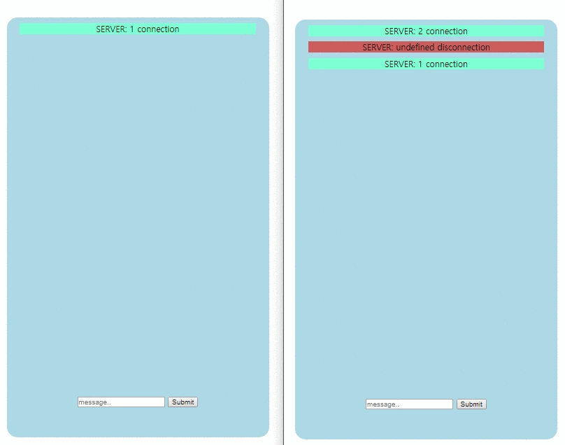

# Real Time Chat (Vue, node)

> front-end: Vue.js
>
> back-end: node.js

### Overview

뷰로 socket.io를 적용하여 채팅 시스템을 만들었다.

우선 구현을 위하여 코드를 더럽게 짜서 최적화가 필요하다.

**server module**

- socket.io
- express

**front module**

- socket.io-client

### Server Setup

```bash
# install dependencies
npm install

# serve with hot reload at localhost:3001
node app.js
```


### Vue Setup

```bash
# install dependencies
npm install

# serve with hot reload at localhost:8080
npm run dev
```

### code

#### client

```vue
<template>
    <div id="main">
      <div id="chat">
        <!-- chat area -->
          <div 
            v-for="(item, index) in messages"
            v-bind:class="chatClassName(item)"
            :key="index">
            {{messageFunc(item)}}
          </div>
      </div>
      <div>
        <input
          type="text"
          id="test"
          placeholder="message.."
          v-model="message"
          v-on:keydown="handlePress"
        />
        <button v-on:click="sendMessage">Submit</button>
      </div>
    </div>
</template>

<script>
import io from 'socket.io-client';

export default {
  name: 'HelloWorld',
  data() {
    return {
      message: '',
      messages: [],
      socket : io('localhost:3001')
    }
  },
  methods: {
    chatClassName: (item) => {
      if (item.name === 'me') return 'me'
      else if (item.type === 'connect') return 'connect'
      else if (item.type === 'disconnect') return 'disconnect'
      else return 'other'
    },
    messageFunc: (item) => {
      if (item.type === 'message' && item.name !== 'me') return item.name + ": "+item.message
      else return item.message
    },
    handlePress: (e) => {
      if (e.key === 'Enter') {
        this.sendMessage()
      }
    },
    sendMessage: () => {
      this.messages = [...this.messages, {type: 'message', name: 'me', message: this.message}]
      this.socket.emit('message', {
        type: 'message',
        message: this.message
      })
      this.message = ''
    }
  },
  mounted() {
    this.socket.emit('newUser')
    this.socket.on('update', (data) => {
        console.log(data)
        let message = {...data}
        this.messages = [...this.messages, data]
      }
    )
  },
  created() {
    
  }
}
</script>

```

#### server

```javascript
const express = require('express')
const socket = require('socket.io')
const http = require('http')
const fs = require('fs')

const PORT = 3001

const app = express()
const server = http.createServer(app)

const io = socket(server)

let userNum = 0

io.sockets.on('connection', (socket) => {

    socket.on('newUser', () => {
        console.log(userNum++, 'connection')
        socket.name = userNum
        io.sockets.emit('update', {type: 'connect', name: 'SERVER', message: userNum + ' connection'})
    })

    socket.on('message', (data) => {
        data.name = socket.name
        socket.broadcast.emit('update', data);
    })

    socket.on('disconnect', () => {
        console.log(socket.name + 'disconnection')
        socket.broadcast.emit('update', {type: 'disconnect', name: 'SERVER', message: socket.name + ' disconnection'})
    })
})


server.listen(PORT, () => {
    console.log('Server running at ', PORT)
})
```


### Result



